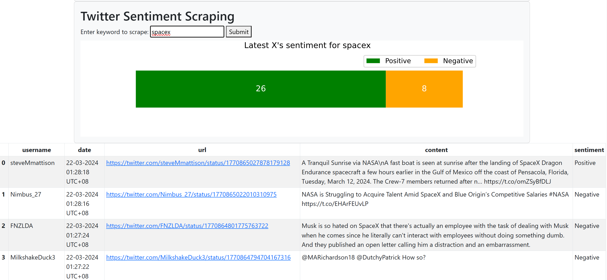

# Sentiment Scraper

"End-to-end" sentiment analysis project (fancy name)

- EDA on Twitter sentiment140 dataset: https://github.com/baobaybong/sentiment-scraper/blob/main/eda.ipynb
- Modelling: simple TF-IDF + Naive Bayes model with 76% test accuracy
- Deployment: simple Flask website that can scrape the latest X (Twitter) tweets about a certain person/topic and analyze the sentiment of the tweets. Link: https://huggingface.co/spaces/baobaybong/sentiment-scraper

## Limitations
- As you can see, the website currently does not have any front-end, very ugly. The back-end code is ugly and buggy as well.
- The model can be improved, currently it is very simple and not very accurate. It is also a sentiment binary classification model, which doesn't account for the intensity or neutrality of sentiments.
- Functionalities can be added. 
- Due to Twitter's API regulation, only a maximum of 300 tweets can be scraped per account per day. The website will scrape less than 50 tweets per request to avoid hitting the limit. (I don't know how legal is scraping with multiple accounts T_T).
- Vulnerable as ****. XSS-ed by my friend within 5 seconds of me sending him the website link. Current design of requests is insecure.